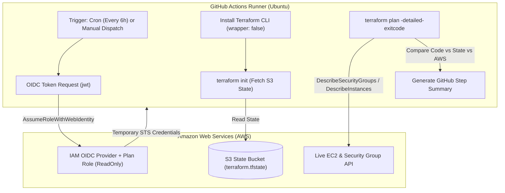
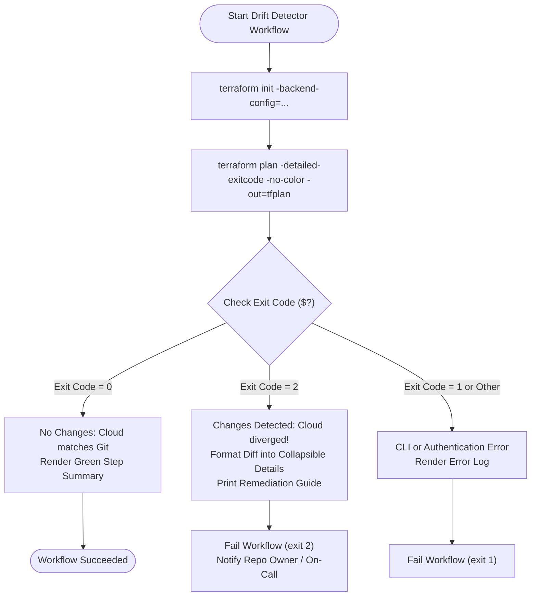
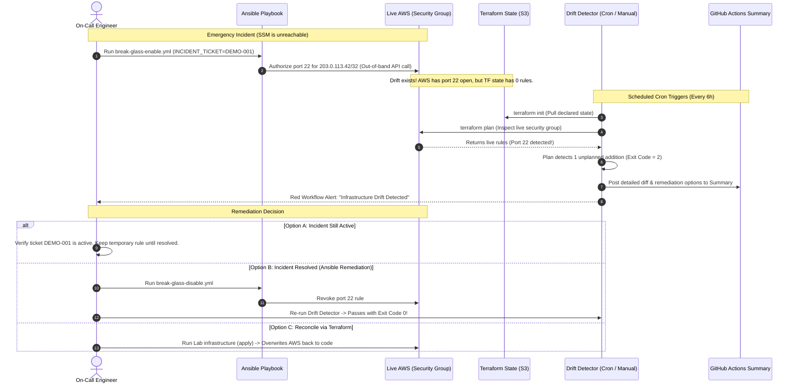
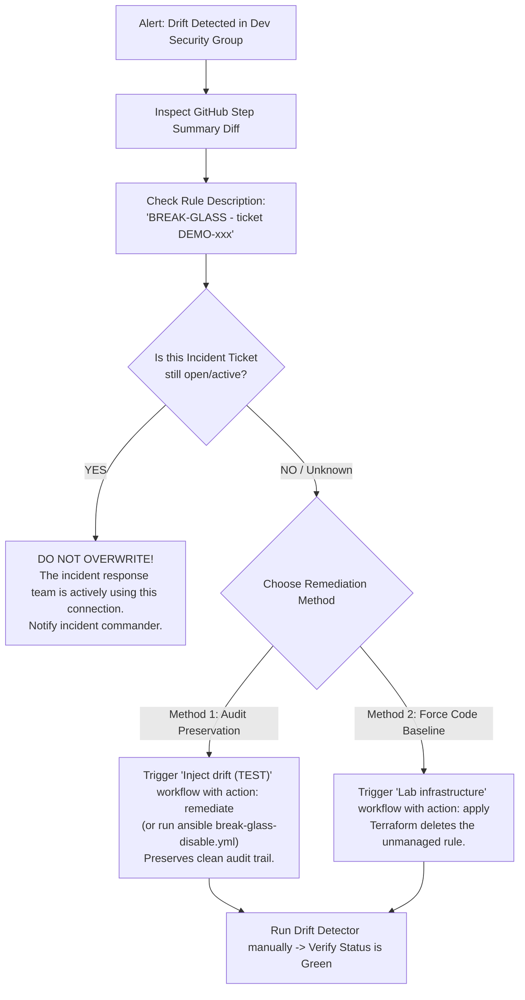

# Infrastructure Drift Detection — Architecture & Operations Guide

> **Target Audience:** Junior to Senior Software & DevOps Engineers
> **Workflows:** [`.github/workflows/drift-detector.yml`](../.github/workflows/drift-detector.yml) | [`.github/workflows/inject-drift.yml`](../.github/workflows/inject-drift.yml)
> **Environment:** `terraform/environments/dev` & `ansible/playbooks/`

---

## 1. What "Drift" Means in This Lab

In Infrastructure as Code (IaC), **drift** occurs when real-world cloud resources diverge from the configuration declared in source control.

In this repository:
* **The Declared State (Terraform):** `terraform/environments/dev` defines an EC2 instance and a security group with **zero inbound rules** (`terraform/modules/ssm-instance/main.tf`). Access is exclusively via AWS Systems Manager (SSM) Session Manager — no SSH key, no open port 22, by design.
* **The Legitimate Incident Tool (Ansible):** [`ansible/playbooks/break-glass-enable.yml`](../ansible/playbooks/break-glass-enable.yml) is a break-glass incident-response tool. When SSM itself is unreachable during an emergency, this playbook opens a scoped, temporary SSH ingress rule (single IP CIDR, never `0.0.0.0/0`), pushes an ephemeral 60-second public key via EC2 Instance Connect, and schedules auto-revocation via `at`.
* **The Drift Scenario:** That playbook modifies the AWS Security Group **directly via the AWS EC2 API** — completely outside Terraform. Terraform's state file (`terraform.tfstate` in S3) has no record of this change.

If the self-scheduled auto-revoke doesn't fire (the `at` daemon isn't running, the task ran on a disposable CI runner VM, or the engineer forgot manual cleanup), the rule persists indefinitely: **reality has diverged from declared state, and nothing will notice unless automated detective controls are actively looking.**

```
    +-------------------------+               +-------------------------+
    |   Declared State (Git)  |               |  Real World (Live AWS)  |
    |   EC2 Security Group:   |  DIVERGENCE   |   EC2 Security Group:   |
    |   0 Inbound Rules       | <===========> |   Port 22 OPEN (SSH)    |
    |   (SSM Session only)    |    (DRIFT)    |   (Added via Ansible)   |
    +-------------------------+               +-------------------------+
```

---

## 2. System Architecture & Zero-Secret OIDC

The drift detection mechanism runs in GitHub Actions using **AWS OpenID Connect (OIDC)** federated identity — no permanent AWS access keys (`AWS_ACCESS_KEY_ID` / `AWS_SECRET_ACCESS_KEY`) are ever stored in GitHub.



### Least Privilege IAM Boundary

1. **`PLAN_ROLE_ARN` (Read-Only Detective Control):**
   * The scheduled drift detector assumes `PLAN_ROLE_ARN`.
   * It only has permissions to describe resources (`ec2:Describe*`, `s3:GetObject`).
   * Even if an attacker compromises the workflow runner, the drift detector **cannot alter or destroy cloud resources**.
2. **`APPLY_ROLE_ARN` (Mutating Control):**
   * Only assumed by gated workflows running in the `production` GitHub Environment.
   * Used exclusively by `apply.yml` and `inject-drift.yml`.

---

## 3. The Detection Engine: How It Works Under the Hood

The detective control relies on Terraform's **`-detailed-exitcode`** flag.

### Standard vs Detailed Exit Codes

Normally, `terraform plan` exits with `0` as long as it executes without crashing. With `-detailed-exitcode`, Terraform signals differences between live infrastructure and declared code:

| Exit Code | Meaning | Detective Control Action | Result |
| :---: | :--- | :--- | :---: |
| **`0`** | **In Sync:** Live AWS matches Terraform code. Plan diff is completely empty. | Emits green confirmation in `$GITHUB_STEP_SUMMARY`. | ✅ Passed |
| **`1`** | **Execution Error:** Syntax error, AWS rate limit, network failure, or invalid IAM permissions. | Emits red failure banner; terminates workflow. | ❌ Error |
| **`2`** | **Drift Detected:** Terraform succeeded, but found changes! Live infrastructure diverged. | Captures diff into summary, alerts team, and fails job (`exit 2`). | ⚠️ Drift Found |



> [!IMPORTANT]
> **Why `terraform_wrapper: false` is required:**
> By default, GitHub's `hashicorp/setup-terraform` action wraps the `terraform` CLI in a Node.js wrapper script. This wrapper intercepts stdout and normalizes non-zero exit codes to `0` or `1`, masking exit code `2`. Setting `terraform_wrapper: false` ensures the true exit code `2` passes directly to our evaluation script.

---

## 4. End-to-End Incident Lifecycle

Here is how an emergency break-glass event creates drift, how CI catches it, and how an engineer resolves it:



---

## 5. The Remediation Playbook (Junior Engineer Checklist)

Diagnosing drift and remediating it are two distinct steps. **Never blindly run `apply` to eliminate drift without investigation.**

Follow this triage decision tree:



### Remediation Tradeoffs

| Remediation Path | How to Execute | When to Use | Audit Trail Impact |
| :--- | :--- | :--- | :--- |
| **Ansible Playbook** (`break-glass-disable.yml`) | Run **Inject drift (TEST)** with `action: remediate`, or run playbook locally | Preferred for known incidents. | **High:** Explicitly attributes the closure of the emergency session in CloudTrail and Ansible logs. |
| **Terraform Apply** | Run **Lab infrastructure** with `action: apply` | Use when drift is from unknown origins (e.g. manual AWS console changes) or incident scripts are unavailable. | **Medium:** Terraform forces live AWS back to declared code, wiping out the unmanaged rule. |

---

## 6. Try It Yourself

You can test this entire lifecycle either completely within **GitHub Actions** or locally using the **CLI**.

### Method A: Via GitHub Actions (Recommended)

1. **Verify Baseline State:**
   * Go to **Actions** → **Drift Detector** → **Run workflow**.
   * The job completes green: `✅ Infrastructure In Sync`.
2. **Inject the Drift:**
   * Go to **Actions** → **Inject drift (TEST)** → **Run workflow** (action: `inject`, ticket: `DEMO-001`).
   * The playbook adds an emergency port 22 rule directly to AWS.
3. **Run the Detector to Observe Drift:**
   * Go to **Actions** → **Drift Detector** → **Run workflow**.
   * The job **fails** with exit code 2. Click into the run summary to see the full `terraform plan` diff showing the unplanned ingress rule.
4. **Remediate:**
   * Go to **Actions** → **Inject drift (TEST)** → **Run workflow** (action: `remediate`).
   * Or go to **Actions** → **Lab infrastructure** → `apply`.
5. **Confirm Clean State:**
   * Re-run **Drift Detector** → passes with exit code 0.

### Method B: Via Local Terminal

```bash
# 1. Ensure live dev environment is applied
cd terraform/environments/dev
terraform apply

# 2. Inject drift via Ansible
cd ../../../ansible
INCIDENT_TICKET=DEMO-001 ansible-playbook -i inventory.aws_ec2.yml playbooks/break-glass-enable.yml

# 3. Observe the drift locally
cd ../terraform/environments/dev
terraform plan
# Notice the unplanned inbound SSH rule!

# 4a. Remediate via Ansible (preserves audit trail)
cd ../../../ansible
INCIDENT_TICKET=DEMO-001 ansible-playbook -i inventory.aws_ec2.yml playbooks/break-glass-disable.yml

# 4b. ...OR remediate via Terraform apply
cd ../terraform/environments/dev
terraform apply
```
